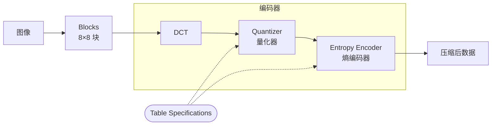
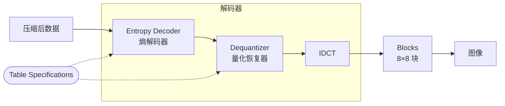

# 基于DCT变换的图像编码

## 运行效果

```matlab
% 测试
>> cd src
>> runtests
……
总计:
   13 Passed, 0 Failed, 0 Incomplete.
   0.26174 秒测试时间。
```

```matlab
% 图像的编码与解码
>> main
```

这会编码`./data/grayLena.png`，然后再解码。

<figure>
    <div style="display: grid; grid-template-columns: 1fr 2fr;">
        
        
    </div>
    <figcaption>左：原图<br>右：编码再解码后</figcaption>
</figure>

```matlab
% 编码过程中的一些细节
>> main_hack
% 该脚本的结果及解释见下。
```

## 压缩算法

### 大致原理

标准 JPEG 算法如下。





- **图像**：彩色图像，亮度、颜色分开处理，颜色的分辨率比亮度小。
- **熵编码**：DC、AC 分开处理，DC 用 DPCM（Differential Pulse Code Modulation），AC 用游程编码和 Huffman 编码。

我这里实现的压缩算法大体与它相同，只是有如下区别。

- **图像**：只处理灰度图像。因此后续量化时只用亮度一张表，不用颜色的表。
- **熵编码**：DC、AC 不作区分，统一用游程编码，并且不再进一步用 Huffman 编码。因此我这里熵编码没有第二张规定的表（上图中的 Table Specifications）。

### 流程

#### 1 分块（`split_to_blocks`、`merge_from_blocks`）

- **转换数据类型**

  原始图像是`uint8`、$[0, 256)$，转换后是`double`、$[-128, 128)$。

- **分块／合并**

  后续 DCT（Discrete Cosine Transform）关注图像中的强关联。为了让它几种精力处理“空间位置接近”的关联，要把图像划分成一系列 8×8 的小块。

  由于图像长宽不一定是 8 的整倍数，还要补零或切零。

  原始图像是 685×806，补零为 688×808，分块后是 8×8 × 8686。

#### 2 变换（`dct_2d`、`idct_2d`）

对每一个 8×8 块分别应用二维 DCT 变换。

如下图，变换后低频部分（横纵坐标较小的）数值较大，高频部分几乎为零。

<figure>
    <div style='display: grid; grid-template-columns: repeat(2, auto);'>
        
        
    </div>
    <figcaption>变换后块中各点取值的绝对值的平均值（此后简称“情况”）</figcaption>
</figure>

#### 3 量化（`quantize`、`dequantize`）

- **量化**

  按量化表（`src/luminance_quantum.csv`）量化（多对一映射）上一步结果，低频量化精度更高。

- **转换数据类型**

  上一步是`double`，之后都是`int8`。

量化后，出现非常多的零，剩下非零部分的范围也缩小了。

> 由图，上一步范围大致是 $[e^1, e^6]$，量化后则是 $[e^{-8}, e^2]$。


```matlab
>> main_hack
……
量化后，非零元素只占 6.5%。
……
```

<figure>
    
    <figcaption>量化后情况</figcaption>
</figure>

#### 4 斜线扫描（`zigzag_destruct`、`zigzag_construct`）

上一步每块数据仍是 8×8 块，为方便后续熵编码，斜线扫描为 64 序列。

<figure>
    
    <figcaption>斜线扫描｜<a href="https://medium.com/geekculture/how-jpeg-compression-works-a751cd877c8c">Bilal Himite</a></figcaption>
</figure>

下面以解码时的`zigzag_construct`为例，介绍我的实现。

1. **在第一维应用置换。**

   ```matlab
   sequences = sequences(zigzag_permutation(8), :);
   ```

   其中`zigzag_permutation(n)`构造一段序列，“第 $i$ 个元素为 $p$”表示（在 $n\times n$ 方阵中）线性索引为 $i$ 的那个元素（在斜线扫描后）应当位于 $p$ 处。

   ```matlab
   >> zigzag_permutation(3)
   ans =
        1     3     4     2     5     8     6     7     9
   
   >> reshape(ans, 3, 3)
   ans =
        1     2     6
        3     5     7
        4     8     9
   ```
   
   > `zigzag_permutation`是我自己写的函数，很繁琐。我在[源代码](./src/zigzag_permutation.m)里简单解释了一下，请参考。

2. **将 64×n 重建为 8×8×n。**

   ```matlab
   blocks = reshape(sequences, 8, 8, []);
   ```

#### 5 熵编码（`serialize`、`deserialize`）

- **游程编码**

  分别对每一串 64 序列应用游程编码。

  我这里只记“零”的游程，所以编码后是一些二元对 (前导零的数量, 非零元)。若最后剩一串零，则直接忽略——解码时能根据序列长补上。

  每一串序列编码前是`(1, :)`，编码后是`(:, 2)`。

- **序列化**

  每串序列游程编码后不一样长，难以直接存储。我这里将它们排成一大串，用`[0 0]`分隔。

  序列化前是一系列`(:, 2)`，之后是`(1, :)`。

到这里，我的整个编解码过程就结束了。

```matlab
>> main_hack
……
游程编码后，数据量从 539.2 kiB 降到了 87.4 kiB，仅为 16.2%。
编码后数据分布仍不均匀，而且是两种分布混合（零附近的 AC 与 +60 附近的 DC）。
若当成无记忆信源，按频率估计概率，则码率只有 3.11 bits/sig，效率仅为 38.8%。
总之仍有进一步压缩空间。
……
```

> “数据量”指最终`int8`序列的大小。

<figure>
    
    <figcaption>游程编码后数据</figcaption>
</figure>
> 图片原文件有 271.0 kiB，如果抛去色彩因素，除以 3，是 90.3 kiB，和我这结果差不多。
>
> 假如再进一步用 Huffman 编码，把效率提高到百分之八九十，能进一步压缩。

### 评估

```matlab
>> main_hack
……
均方误差失真为 8.45。
```

<figure>
    
    <figcaption>图像逐点误差绝对值</figcaption>
</figure>


如上图，大部分地方几乎没误差（10 以下），个别地方（主要是图形边缘）误差超过 60。再看大体趋势，粗糙的帽子、装饰物误差大，光滑的皮肤、墙误差小。

## 案例分析

### 准备

```matlab
>> img = imread('../data/grayLena.png');
>> img = img(:,:,1);
>> blocks = split_to_blocks(img);
```

以第 4012 个 8×8 块为例。

```matlab
>> b = blocks(:, :, 4012)
b =
   -68   -70   -73   -71   -68   -66   -70   -74
   -69   -70   -71   -69   -71   -69   -69   -75
   -66   -65   -71   -68   -71   -64   -67   -73
   -66   -58   -72   -69   -70   -64   -76   -76
   -68   -67   -74   -66   -68   -67   -66   -63
   -66   -67   -73   -70   -59   -55   -64   -73
   -66   -67   -66   -65   -52   -54   -63   -72
   -72   -66   -59   -61   -56   -51   -61   -67

>> imagesc(b)
>> colorbar
```


$4012 = \qty(688/8) \times 46 + 56$，这一块的左上角是原图的 $(46 \times 8,\ 56 \times 8) = (368, 448)$，位置大概如下图。

```matlab
>> c = zeros(685, 806, 3);
>> c(:, :, 1) = img; c(:, :, 2) = img; c(:, :, 3) = img;

% ↓ 为方便观察，画大一些。
>> c(368-10: 368+17, 448-10: 448+17, 2:3) = 0;
>> c(368-10: 368+17, 448-10: 448+17, 1) = 255;

>> imshow(uint8(c))
```


### 编码过程

块已经分好，直接做**变换**。

```matlab
>> f = dct_2d(b)
f =
 -535.3750   -1.1743  -10.9493   18.8169   -6.6250   -3.8048   -1.2825   -5.4665
  -22.3232    9.4353   11.1650   -4.6140    2.0613    3.8193   -2.6819   -3.4957
    6.3135   -5.6039   -9.4649    0.6775   -2.4266    2.5936    4.0115    6.4664
   -3.5483   -4.5528    2.2108    5.5377    4.8097   -0.5274   -1.4131    2.8713
   -0.3750    0.5449    1.7009   -6.4958    0.8750   -2.7169    0.5132   -3.5620
    1.0913    6.3358   -2.6617    6.6243   -1.3391   -4.3107    0.4447   -0.1815
    1.8498   -2.3858    0.7615    2.9878   -2.9185    0.4077    0.9649   -1.0884
    2.8205   -5.3440    2.7086   -3.6906    3.7599    3.1789   -1.0114    1.3377

>> imagesc(f)
>> colorbar
```


然后**量化**。

```matlab
>> Q = readmatrix('luminance_quantum.csv');

>> d = quantize(f, Q)
d =
  8×8 int8 矩阵
   -33     0    -1     1     0     0     0     0
    -2     1     1     0     0     0     0     0
     0     0    -1     0     0     0     0     0
     0     0     0     0     0     0     0     0
     0     0     0     0     0     0     0     0
     0     0     0     0     0     0     0     0
     0     0     0     0     0     0     0     0
     0     0     0     0     0     0     0     0
```

接着**斜线扫描**。

```matlab
>> s = zigzag_destruct(d)
s =
  64×1 int8 列向量
   -33
     0
    -2
     0
    ……
```

最后**熵编码**。只记录了开头 $7 + 1 + 1 + 4 = 13$ 个元素，剩下都是零。

```matlab
>> run_length_encode(s.')
ans =
  7×2 int8 矩阵
     0   -33
     1    -2
     1     1
     0    -1
     0     1
     0     1
     4    -1
```

用`serialize`就是压平再补分隔符。

```matlab
>> bytes = serialize(s)
bytes =
  1×16 int8 行向量
     0   -33     1    -2     1     1     0    -1     0     1     0     1     4    -1     0     0
```

### 评估

```matlab
>> whos('bytes', 'b')
  Name      Size            Bytes  Class     Attributes
  b          8x8               512  double
  bytes      1x16               16  int8
```

编码前是 8×8 个`int8`，一共 64 B；编码后是 16 个`int8`，共 16 B。因此压缩比为 25.0%。

下面来看失真。

```matlab
>> recovered = decode_img(bytes, 8, 8)
recovered =
  8×8 uint8 矩阵
    94    93    92    93    94    93    90    88
    95    94    92    93    94    93    91    89
    96    94    92    92    94    94    93    92
    97    95    93    93    94    95    95    94
    96    95    94    95    96    97    96    95
    95    95    95    97    99    99    97    95
    93    94    97   100   102   101    98    94
    92    94    97   101   104   102    98    94

% ↓ uint8 可能溢出，故要先转换。
>> int8(double(recovered) - double(img(368: 368+7, 448: 448+7)))
ans =
  8×8 int8 矩阵
   -20   -22   -27   -33   -27   -30   -31   -38
    -1     4    -7   -20   -23   -29   -35   -32
     4     7     7     3     2   -20   -25   -26
   -14   -10    -3    -7     7    -2   -18   -25
   -29   -24   -17   -15    -7    -1   -13   -26
   -37   -31   -24   -22   -19   -17   -15   -25
   -37   -30   -19   -19   -16   -21   -30   -43
   -44   -35   -21   -20   -23   -40   -58   -79

>> mean(ans .^ 2, 'all')
ans =
  104.3281
```

均方误差为 104.3，其算术平方根为 10.2，与 256 相比不是很大。

## 可能存在的问题

`padarray`等函数需要 Image Processing Toolbox。

## 参考

- [图像处理-余弦变换 - PamShao - 博客园](https://www.cnblogs.com/pam-sh/p/14533603.html)

- [数字图像处理（三）—— 离散余弦变换 - 知乎](https://zhuanlan.zhihu.com/p/114626779)（[GitHub](https://github.com/Jingtao-ZHANG/DigitalImageProcessingWithPython/blob/master/04-DCT.py)）

- [The JPEG Still Picture Compression Standard](https://www.ijg.org/files/Wallace.JPEG.pdf)

  `Wallace.JPEG.pdf`

- [JPEG at 25: Still Going Strong | IEEE Journals & Magazine | IEEE Xplore](https://ieeexplore.ieee.org/document/7924246)

  `JPEG_at_25_Still_Going_Strong.pdf`

- [Digital compression and coding of continuous-tone still images requirements and guidelines](https://repo.zenk-security.com/Cryptographie%20.%20Algorithmes%20.%20Steganographie/DIGITAL%20COMPRESSION%20AND%20CODING%20OF%20CONTINUOUS-TONE%20STILL%20IMAGES%20REQUIREMENTS%20AND%20GUIDELINES.pdf)

  `ISO_IEC_10918-1-1993-E.pdf`

- [How JPEG Compression Works. Explaining the magic steps behind JPEG… | by Bilal Himite | Geek Culture | Medium](https://medium.com/geekculture/how-jpeg-compression-works-a751cd877c8c)

- [JPEG不可思议的压缩率——归功于信号处理理论 | 圆桌字幕组 | 哔哩哔哩](https://www.bilibili.com/video/BV1iv4y1N7sq/)
